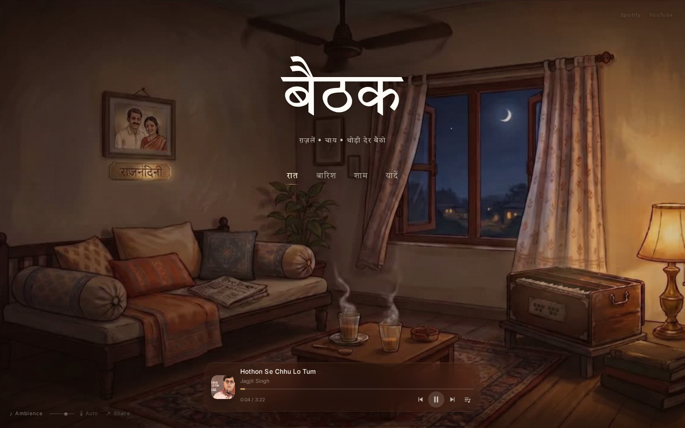
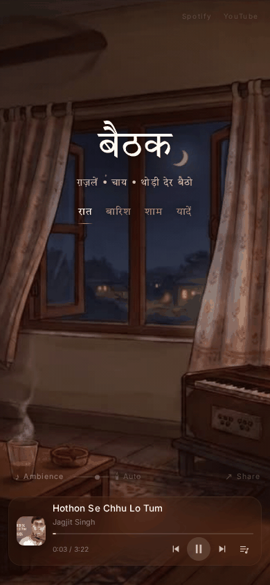

# BETHAK

## A quiet place on the internet.

BETHAK (बैठक) is an immersive listening experience inspired by the feeling of sitting in a
traditional Indian bethak — a late-night sitting room with ghazals playing softly, chai on the
table and the fan turning overhead. It combines curated ghazal sessions, cinematic room scenes,
ambient sound layers and a few small interactive discoveries.

It is not a streaming service, not a game and not an app with a dashboard. It is one room.



## Live

[BETHAK — Open the room](https://bethak-ambient-vibes.lovable.app)

The production experience lives at `/`. Everything else in this repository is supporting code or
a documented development prototype — do not treat other routes as the demo.

## Preview

| Desktop | Mobile |
| --- | --- |
|  |  |

Screenshots live in `docs/images/`. Two optional assets are not committed yet, and would be nice
additions if you want to document those features visually:

- `docs/images/bethak-pan.png` — mobile portrait mid-pan, showing the wider scene
- `docs/images/bethak-candle.png` — the room with Candle lighting enabled

Keep README assets as compressed images or short GIFs. Do not commit raw video for previews.

## What makes BETHAK different?

### 🎵 Ghazal listening

Curated, mood-based listening sessions rather than an endless catalogue.

### 🌧️ Ambient sound

An independent ambient layer per mood, with smooth crossfades and its own volume.

### 🎬 Cinematic rooms

Four visual environments: **Raat**, **Baarish**, **Shaam**, **Yaadein**.

### ↔️ Mobile room exploration

On portrait mobile you can gently pan sideways across the wider cinematic scene; the pan is
clamped geometrically so the video edges are never exposed.

### 🕯️ Room lighting

Auto / Warm / Dim / Candle atmospheric lighting, rendered inside the room frame so it pans with
the scene.

### 🫖 Chai Ki Chuski

A subtle discoverable interaction on the chai — a ceramic clink and a quiet thought.

### 🎹 Harmonium

A second hidden interaction, which opens once the chai has been found, playing a soft note.

### 🔗 Shareable moods

Mood-specific deep links, e.g. `/?mood=baarish`.

### 💾 Session persistence

Remembers mood, track, position and preferences without ever violating browser audio rules.

### 🔇 Audio lifecycle

Nothing plays before you enter the room, and everything stops when the tab goes to the
background — with no autoplay on return.

## How it feels

BETHAK is intentionally not an infinite feed. You enter, you listen, you stay a while.

> Not something to scroll. Somewhere to sit.

## Built with

- React 19 + TypeScript
- TanStack Start / TanStack Router (file-based routing, SSR)
- Vite
- Tailwind CSS v4 with a hand-written atmospheric stylesheet (`src/styles.css`)
- YouTube IFrame Player API — the actual music playback engine
- HTML5 `<video>` for the room scenes, HTML5 `<audio>` for ambience and interaction sounds
- `localStorage` for session and preference persistence

No backend, no database, no API keys.

## Architecture

```text
Visitor
  ↓ enters the room (single user gesture unlocks all audio)
Room / Scene  ──  Lighting layer  ──  Interaction hotspots
  ↓
Music engine   Ambience engine
  ↓
Persistence (localStorage)
```

### Music engine — `src/services/musicEngine.ts`

Playback through the YouTube IFrame API, session/playlist state, shuffle and repeat, position
tracking, and a cached snapshot consumed by the player via `useSyncExternalStore`.

### Ambience engine — `src/services/ambienceEngine.ts`

One ambience track per mood, crossfaded on mood change, with independent volume and persistence.

### Room / scene — `src/components/BethakBackground.tsx`, `src/data/scenes.ts`, `src/hooks/useRoomPan.ts`

Looping dual-video layers, per-mood responsive crop focal points, and the clamped mobile portrait
pan.

### Interaction hotspots — `src/components/ChaiSpot.tsx`, `src/components/HarmoniumSpot.tsx`

Invisible, discoverable hotspots with their own one-shot sounds (`src/services/chaiSound.ts`,
`src/services/harmoniumSound.ts`).

### Lighting — `src/components/RoomLight.tsx`, `src/lib/roomLight.ts`

Auto / Warm / Dim / Candle overlays rendered inside the room frame.

### Persistence — `src/lib/bethakSession.ts`

Mood, current track, playback position (24h TTL) and user preferences.

## Project structure

```text
src/
  components/     room, player, controls, hotspots (ui/ holds unused shadcn primitives)
  routes/         index.tsx (the room), bethak.tsx (mood redirect), pan-lab.tsx (prototype)
  services/       music, ambience, chai and harmonium audio engines
  data/           playlist, mood scenes, curated sessions, chai lines
  hooks/          useRoomPan — mobile pan geometry
  lib/            session + lighting persistence helpers
  styles.css      the whole visual system
public/
  scenes/         mood videos and their poster frames
  ambience/       ambient and interaction audio
docs/images/      README screenshots
```

### Editing the playlist

`src/data/bethakPlaylist.ts` is the single editable list: `{ id, title, artist, youtubeId }`.
Artwork is derived automatically from the YouTube thumbnail — never hardcode it.

### `/pan-lab` — development prototype

`src/routes/pan-lab.tsx` is an **experimental development prototype**, kept as a documented
example of how the mobile pan geometry was tuned. It is `noindex`, its debug readout only renders
in dev builds, and it does not affect the production route `/`.

## Getting started

```bash
git clone <repository-url>
cd <repository-name>
npm install
npm run dev
```

The dev server prints a local URL. No environment variables or credentials are required to run
BETHAK locally.

### Scripts

| Command | What it does |
| --- | --- |
| `npm run dev` | Start the Vite dev server |
| `npm run build` | Production build |
| `npm run preview` | Preview the production build |
| `npm run lint` | ESLint |
| `npm run format` | Prettier |

Bun works too (`bun install`, `bun run dev`); the GitHub Pages workflow uses Bun.

## Deployment

- **Lovable** — the live URL above.
- **GitHub Pages** — `.github/workflows/deploy.yml` builds a static SPA on push to `main`. The
  Vite `base` path is derived from `GITHUB_REPOSITORY`, so nothing is hardcoded.

## Content note

BETHAK does not host or distribute music. Playback is delegated to the official YouTube IFrame
Player API, and each track links back to its source on YouTube. Ambient and interaction sounds are
generated for this project. The room illustrations and videos belong to the project author.

---

Built with [Lovable](https://lovable.dev).
